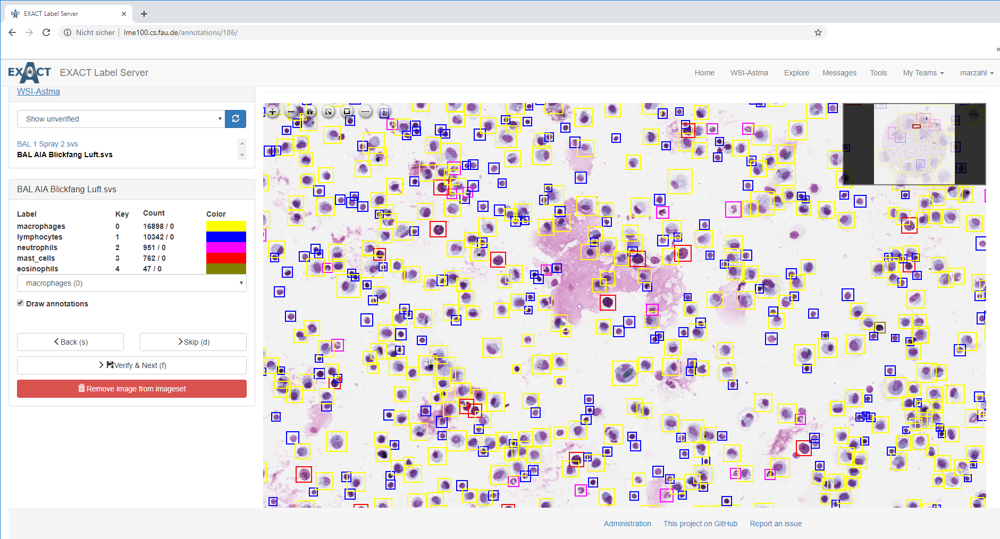

# Exact

This is a collaborative online tool for labeling image data.




## Features

* team creation
* upload image sets in the multiple formats like: [whole slide image (WSI) formats](https://openslide.org/api/python/) or .png, .jpg, .jepg, .bmp etc. 
* bounding box
* export format creation
* label export
* image preloading for labeling and verification
* label verification
* upload of existing labels
* WSI [viewer](https://openseadragon.github.io/) 


## Install


### Docker

Install Docker

Checkout the latest release:

```
git clone https://github.com/ChristianMarzahl/Exact.git
```

#### Development

Copy and rename `settings.py.example` to `settings.py` in the exact folder.

Modify the configuration files: `env.dev` and `env.dev.db` or use the default configuration. 

Build and run the container:
```
docker-compose -f docker-compose.yml up -d --build
docker-compose logs -f 
```

Navigate to http://localhost:8000/
For default the super user login is:
```
User: exact
Pw: exact
```

#### Production

Additional features:
- gunicorn
- nginx

Copy the files `env.dev` and `env.dev.db`, rename to `env.prod` and `env.prod.db` and change settings according to your preferences.

Copy and rename `settings.py.example` to `settings.py` in the exact folder.

Build and run the container:
```

docker-compose -f docker-compose.prod.yml up -d --build
docker-compose -f docker-compose.prod.yml exec web python manage.py migrate --noinput 
docker-compose -f docker-compose.prod.yml exec web python manage.py createsuperuser
docker-compose -f docker-compose.prod.yml exec web python manage.py collectstatic --no-input --clear
docker-compose -f docker-compose.prod.yml logs -f
```

Navigate to  http://localhost:1337/


####  Cloud

To use cloud services like [amazon fargate](https://aws.amazon.com/fargate/). The exact server has to connect to a cloud database like [amazon rds](https://aws.amazon.com/rds/).   


Copy the files `env.dev` and `env.dev.db`, rename to `env.prod` and `env.prod.aws-db` and change settings according to your preferences.

Copy and rename `settings.py.example` to `settings.py` in the exact folder.

Build and run the container:
```
docker-compose -f docker-compose.prod.aws-db.yml down -v --remove-orphans
docker-compose -f docker-compose.prod.aws-db.yml up -d --build
docker-compose -f docker-compose.prod.aws-db.yml exec web python manage.py migrate --noinput
docker-compose -f docker-compose.prod.aws-db.yml exec web python manage.py createsuperuser
docker-compose -f docker-compose.prod.aws-db.yml exec web python manage.py collectstatic --no-input --clear
docker-compose -f docker-compose.prod.aws-db.yml logs -f
```

Send container to [AWS ECR](https://aws.amazon.com/ecr/)
```
Invoke-Expression -Command (aws ecr get-login --no-include-email)

docker tag exact_nginx:latest **************.dkr.ecr.eu-central-1.amazonaws.com/exact_nginx:latest
docker tag exact_web:latest **************.dkr.ecr.eu-central-1.amazonaws.com/exact:latest

docker push **************.dkr.ecr.eu-central-1.amazonaws.com/exact_nginx:latest
docker push **************.dkr.ecr.eu-central-1.amazonaws.com/exact:latest
```

### MacOS or Linux 

Checkout the latest release:

```
git clone https://github.com/ChristianMarzahl/Exact.git
```

In our production Senty is used for error reporting (pip install raven).
django-auth-ldap is used for login via ldap
uwsgi is used to serve the app to nginx

Install Python Dependencies:

```
pip3 install -r requirements.txt
```

Copy settings.py.example to settings.py in the exact folder:

```
cp exact/exact/settings.py.example exact/exact/settings.py
```

and customize the settings.py.

The following settings should probably be changed:

+ The secret key
+ The DEBUG setting
+ The ALLOWED\_HOSTS
+ The database settings
+ The UPLOAD\_FS\_GROUP to the id of the group that should access and create the uploaded images

For the database, postgresql is used. Install it by running `sudo apt install postgresql`

Initialize the database cluster with `sudo -iu postgres initdb --locale en_US.UTF-8 -D '/var/lib/postgres/data'`.

Note: It may be that initdb is not in your current PATH (seems to be default for postgresql >= 10), in this case, you have to specify the proper path to initdb, e.g:
`sudo -iu postgres /usr/lib/postgresql/*/bin/initdb --locale en_US.UTF-8 -D '/var/lib/postgresql/data'` (for Ubuntu systems)

To start the postgresql server, run `sudo systemctl start postgresql.service`. If the server should always be started on boot, run `sudo systemctl enable postgresql.service`.

Then, create the user and the database by running

`sudo -iu postgres psql`

and then, in the postgres environment

```
CREATE USER exact PASSWORD 'exact';
CREATE DATABASE exact WITH OWNER exact ENCODING UTF8;
```

where of course the password and the user should be adapted to the ones specified in the database settings in the settings.py.

To initialize the database, run `./manage.py migrate`

To create an administrator user, run `./manage.py createsuperuser`.

`./manage.py runserver` starts the server with the configuration given in the settings.py file.

To create annotation types, log into the application and click on Administration at the very bottom of the home page.

For **production** systems it is necessary to run the following commands after each upgrade

```bash
./manage.py migrate
./manage.py compilemessages
./manage.py collectstatic
```

Our production uwisgi config can be found at https://github.com/fsinfuhh/mafiasi-rkt/blob/master/imagetagger/uwsgi-exact.ini

Example Nginx Config:

```
server {
	sendfile on;
	tcp_nopush on;
	tcp_nodelay on;

        listen 443;
        server_name exact.bit-bots.de;

        ssl_certificate /etc/letsencrypt/certs/exact.bit-bots.de/fullchain.pem;
        ssl_certificate_key /etc/letsencrypt/certs/exact.bit-bots.de/privkey.pem;
        include /etc/nginx/ssl.conf;
        include /etc/nginx/acme.conf;
        ssl on;

        client_max_body_size 10000M;
        keepalive_timeout 65;


	access_log /var/log/nginx/access.log;
	error_log /var/log/nginx/error.log;


        location /static {
                expires 1h;
                alias /var/www/exact;
        }

        location /ngx_static_dn/ {
                internal;
                alias /srv/data/exact/storage/pictures/;
        }

        location / {
                include uwsgi_params;
                uwsgi_pass 127.0.0.1:4819;
                uwsgi_read_timeout 120;
        }
}
```

### Upgrade

```
pip install -U -r requirements.txt
./manage.py migrate
```

for additional steps on some releases see instructions
in [UPGRADE.md](https://github.com/ChristianMarzahl/exact/blob/master/UPGRADE.md)


If you want to provide zip files of image sets, set `ENABLE_ZIP_DOWNLOAD = True` in your `settings.py`.
A daemon that creates and updates the zip files is necessary, you can start it with `./manage.py runzipdaemon`.
Please take into account that the presence of zip files will double your storage requirement.

Zip archive download via a script is also possible. The URL is `/images/imageset/<id>/download/`. A successful request
returns HTTP 200 OK and the zip file. When the file generation is still in progress, HTTP 202 ACCEPTED is returned.
For an empty image set, HTTP 204 NO CONTENT is returned instead of an empty zip archive.

## Used dependencies

The exact relies on the following plugins, libraries and frameworks:

- [Bootstrap](https://getbootstrap.com/)
- [Django](https://www.djangoproject.com/)
- [Django REST Framework](http://www.django-rest-framework.org/)
- [django-registration](https://github.com/ubernostrum/django-registration)
- [django-widget-tweaks](https://github.com/jazzband/django-widget-tweaks)
- [imgAreaSelect](http://odyniec.net/projects/imgareaselect/)
- [jCanvas](https://projects.calebevans.me/jcanvas/)
- [jQuery](https://jquery.com/)
- [jQuery-Autocomplete](https://github.com/devbridge/jquery-Autocomplete)
- [jQuery-File-Upload](https://github.com/blueimp/jQuery-File-Upload)
- [Pillow](https://github.com/python-pillow/Pillow)
- [PostgreSQL](https://www.postgresql.org/)
- [OpenSlide](https://openslide.org/)
- [OpenSeadragon](https://openseadragon.github.io//)

We are grateful to the maintainers and contributors of the respective projects.


## Reference

This paper describes the Bit-Bots imagetagger we build on in depth. Please cite if you use this tool in your research:

FIEDLER, Niklas, et al. [imagetagger: An Open Source Online Platform for Collaborative Image Labeling.](https://robocup.informatik.uni-hamburg.de/wp-content/uploads/2018/11/exact_paper.pdf) In: RoboCup 2018: Robot World Cup XXII. Springer, 2018.

```
@inproceedings{exact2018,
   author={Fiedler, Niklas and Bestmann, Marc and Hendrich, Norman},
   year={2018},
   title={exact: An Open Source Online Platform for Collaborative Image Labeling},
   booktitle={RoboCup 2018: Robot World Cup XXII},
   organization={Springer}
}
```