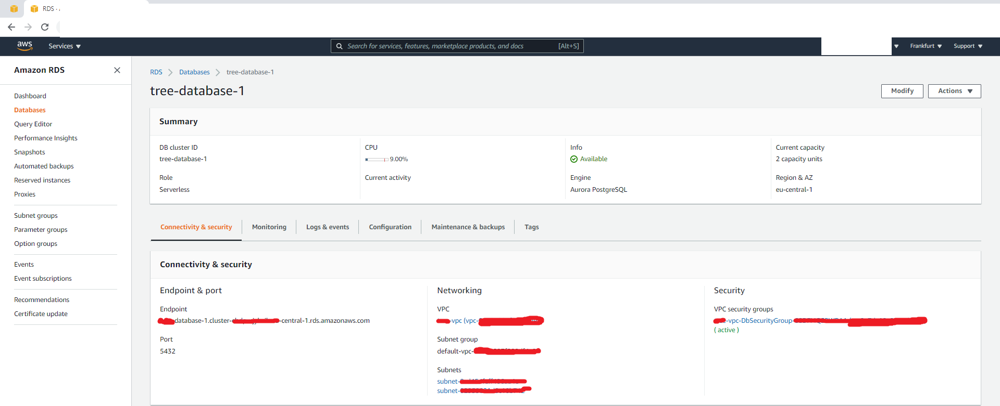
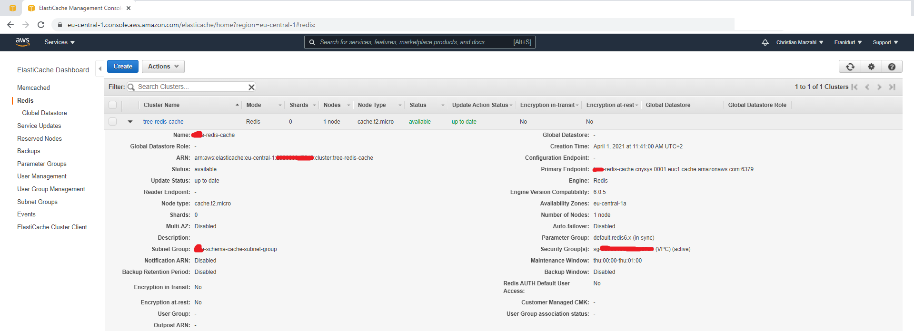
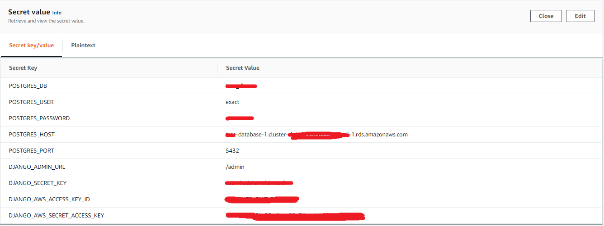

# How to set up EXACT on AWS Fargate

This guide to use EXACT on AWS Fargate is based on this [Tutorial](https://treeschema.com/blog/comprehensive-ecs-deployments-vpcs-deployment/). For furhter information and a deeper understanding, I recomend reading it first. The scripts used the set allmoast everythink up are [AWS Cloud Formation files](https://aws.amazon.com/cloudformation/), please have a look at the documentation.

Predcondition: Install [AWS SAM CLI](https://docs.aws.amazon.com/serverless-application-model/latest/developerguide/serverless-sam-cli-install.html) 

## VPC deployment 

Create the VPC stack at AWS with the [vpc-template](templates/vpc-template.yaml) files. 
- Change the value of the parameter **your-vpc-stack** for example to **exact-vpc-stack**.
- Change the value of the parameter **EnvStageName** for example to **exact-production-123**. !Caution this name needs to be completely unique wordwide! We will derive the S3 bucket name from this and therefore you can not run this command twice with the same name. Furthermore, the same **EnvStageName** needs to be passed to all scripts. 
- Optional: Change the value of the parameter **AvailabilityZone1** and **AvailabilityZone2**.

``` bash
sam deploy \
--template exact/deployment/AWS-Fargate/templates/vpc-template.yaml \
--stack-name {your-vpc-stack} \
--capabilities CAPABILITY_AUTO_EXPAND \
--parameter-overrides "ParameterKey=EnvStageName,ParameterValue=exact-production-april ParameterKey=AvailabilityZone1,ParameterValue=eu-central-1a ParameterKey=AvailabilityZone2,ParameterValue=eu-central-1b"
``` 

## ECS Cluster, CloudFront Distribution and S3 Buckets

The following script will create the ECS cluster, required roles, CloudFront distribution, and S3 buckets. 
- Change the value of the parameter **you-cluster-resources** for example to **exact-cluster-resources**.
- Change the value of the parameter **EnvStageName** to the same value as you used int the section **VPC deployment**.
- Change the value of the parameter **YourUserId** to your AWS Account-ID.
- Optional: Change the value of the parameter **Region** with respect to the availability zone from **VPC deployment**.
```bash 
sam deploy \
--template exact/deployment/AWS-Fargate/templates/ecs-cluster-template.yaml \
--stack-name {you-cluster-resources} \
--capabilities CAPABILITY_AUTO_EXPAND CAPABILITY_NAMED_IAM \
--parameter-overrides "ParameterKey=YourUserId,ParameterValue=your-user-id ParameterKey=EnvStageName,ParameterValue=exact-production-april ParameterKey=Region,ParameterValue=eu-central-1"
```
## Deploy EXACT

### Build container

Build exact

``` bash
build.sh
```

Test the container:

``` bash
docker run -it --entrypoint="./deployment/django/cmds/start"  --name aws_exact_02  ******.dkr.ecr.eu-central-1.amazonaws.com/django_ecs_app:0.0.1
```

### Create the cloud based **Postgres** database. 

- First add subnet groups in the **RDS** console: 
    - *Availability Zones: eu-central-1a and eu-central-1b as defined in section **VPC deployment**.
    - *Subnets*: subnet-*** / 24 for each region.
- Attach the database security group we created. 
    - *exact-vpc-DbSecurityGroup-....*
- Connectivity: *Virtual private cloud (VPC)*: exact-vpc-***
    - *VPC security group*: Chosse existing
- Engine Type: For example AWS Aurora with **Postgres**. 
- Importand remember the settings like username, and master password!
    - Create the database and remember the name
    - Recomendation to save money: *Pause compute capacity after consecutive minutes of inactivity* in **Capacity settings**
    - Public access: No



### Create the Redis instance.



## Create EFS storage

https://docs.amazonaws.cn/en_us/AmazonECS/latest/developerguide/tutorial-efs-volumes.html

### AWS Secrets for Sensitive Information

We save sensitive information in AWS Secrets. 



### Deploy the template

``` bash
sam deploy -t django-app.yaml --stack-name tree-django-ecs-app --capabilities CAPABILITY_IAM  --parameter-overrides 
"ParameterKey=EnvStageName,ParameterValue=tree-april 
ParameterKey=VpcStackName,ParameterValue=tree-vpc  
ParameterKey=EcsCommonStackName,ParameterValue=tree-cluster-resources 
ParameterKey=DjangoSuperuserUsername,ParameterValue=*** 
ParameterKey=EFSVolumeId,ParameterValue=fs-*** 
ParameterKey=DjangoSuperuserPassword,ParameterValue=*** 
ParameterKey=DjangoSuperuserEmail,ParameterValue=*** 
ParameterKey=ConnMaxAge,ParameterValue=60 
ParameterKey=DesiredTasksCount,ParameterValue=1"
```

